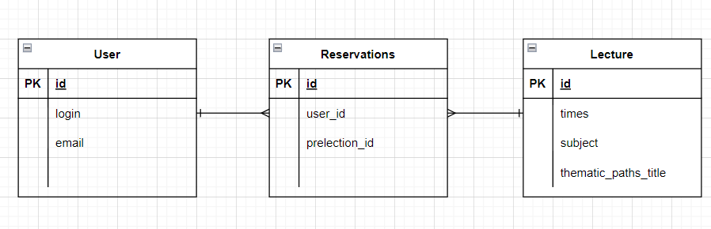

# conference-service

Aby uruchomić aplikację należy uruchomić serwer a następnie skorzystać z polecenia docker-compose up aby uruchomić bazę danych

Endpoint do testowaina

1.Użytkownik może obejrzeć plan konferencji.(metoda get)
 http://localhost:8080/lecture/

2.Użytkownik po podaniu swojego loginu może obejrzeć prelekcje na które się zapisał.(metoda get)
 http://localhost:8080/lecture/S7f3dz14g

3.Jeżeli prelekcja ma jeszcze wolne miejsca, użytkownik ma możliwość dokonania rezerwacji. Podczas dokonywania rezerwacji powinien podać swój login oraz adres e-mail.
http://localhost:8080/reservation/

body
{
"login": "tomasz",
"email": "tomasz@wp.pl",
"title_lecture":"Podstawy springa"
}

rejestracja na prelekcje ktorej nie istnieje

body
{
"login": "lucek",
"email": "lucek@wp.pl",
"title_lecture":"Podstawy spria"
}

rejestracja na prelekcje w pełni zapełnioną

{
"login": "lucek",
"email": "lucek@wp.pl",
"title_lecture":"Python od zera."
}

4. Jeżeli w systemie istnieje już użytkownik z danym loginem, ale z innym adresem e-mail, system powinien zaprezentować komunikat „Podany login jest już zajęty”.
   http://localhost:8080/reservation/

rejestracja na prelekcje w pełni zapełnioną
{
"login": "lucek",
"email": "luce@wp.pl",
"title_lecture":"Podstawy springa"
}

5. Poprawne dokonanie rezerwacji skutkuje wysłaniem powiadomienia użytkownikowi na podany przez niego adres (wysyłka wiadomości - patrz wskazówki).

powiadominie zpostało zapisane przy wcześniejszych zapytaniach

6. Użytkownik może anulować rezerwację.(meotda delate)
http://localhost:8080/user/

próba anulowania przy błędnych danych 

błędny login
http://localhost:8080/reservation/?login=S7f3dz14g&email=krystianszwedo@wp.pl&lectureSubject=Podstawy springa

błędny email
http://localhost:8080/reservation/?login=S7f3dz14g1&email=krystianszwedo@wp.p&lectureSubject=Podstawy springa

błędnna nazwa wykładu
http://localhost:8080/reservation/?login=S7f3dz14g1&email=krystianszwedo@wp.pl&lectureSubject=Podstawy spring

poprawne anulowanie
http://localhost:8080/reservation/?login=S7f3dz14g1&email=krystianszwedo@wp.pl&lectureSubject=Python od zera.

7. Użytkownik może zaktualizować swój adres e-mail.(metoda put)
   http://localhost:8080/user/?login=antek&oldEmail=ant@wp.pl&newEmail=ant@wp.p

Kiedy użytkownik próbuje zaktualizować swój adres e-mail, a login jest zły
http://localhost:8080/user/?login=ante&oldEmail=ant@wp.p&newEmail=ant@wp.p

Kiedy użytkownik próbuje zaktualizować swój adres e-mail, a email jest zły
http://localhost:8080/user/?login=antek&oldEmail=ant@wp.pl&newEmail=ant@wp.p

Kiedy użytkownik próbuje zaktualizować swój adres e-mail, a itnieje taki użytkownik z takimi danymi
http://localhost:8080/user/?login=antek&oldEmail=ant@wp.p&newEmail=ant@wp.p
 
8 System umożliwia wyświetlenie listy zarejestrowanych użytkowników wraz z ich adresami e-mail.(Metoda get)
http://localhost:8080/user/

9 zestawienie wykładów wg zainteresowania (Metoda get)
http://localhost:8080/statistic/lectureStatistics/

9 zestawienie ścieżek tematycznych wg zainteresowania (Metoda get)
http://localhost:8080/statistic/thematicPathsStatistic/

struktura bazy danych
